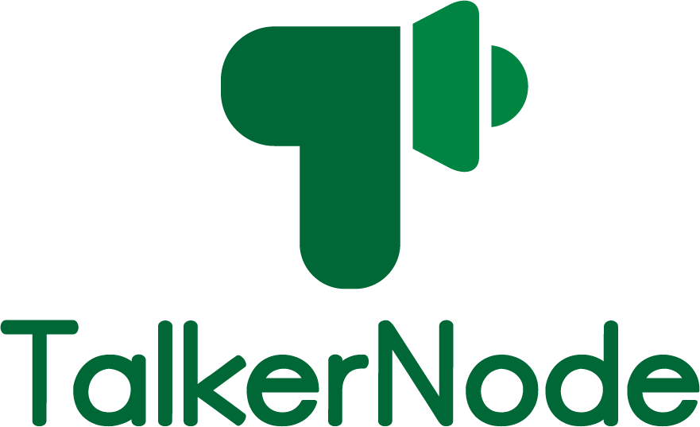

 <p align="center"></p>

TalkerNode is a [Talker](https://en.wikipedia.org/wiki/Talker) base, written in
Node.js .

The latest version of TalkerNode can always be found at
https://github.com/marado/TalkerNode .

## Installation

```bash
> git clone https://github.com/marado/TalkerNode
> yarn # or `npm install`
```

Then, you run the talker by doing:
```bash
> node TallkerNode.js
```

That will make your talker run on the default port (8888), but you can
make it run on a different port by setting up the environment variable PORT:

```bash
> PORT=3333 node TallkerNode.js
```

Now that your talker is running, feel free to connect to it! The first user
created will be of the highest rank. You can connect to your own talker, either
by pointing your favorite MU* client to localhost in port 8888, or, for
instance, using telnet:

```bash
> telnet 0 8888
```

Enjoy!

## License

This is free and unencumbered software released into the public domain.

Anyone is free to copy, modify, publish, use, compile, sell, or
distribute this software, either in source code form or as a compiled
binary, for any purpose, commercial or non-commercial, and by any
means.

In jurisdictions that recognize copyright laws, the author or authors
of this software dedicate any and all copyright interest in the
software to the public domain. We make this dedication for the benefit
of the public at large and to the detriment of our heirs and
successors. We intend this dedication to be an overt act of
relinquishment in perpetuity of all present and future rights to this
software under copyright law.

THE SOFTWARE IS PROVIDED "AS IS", WITHOUT WARRANTY OF ANY KIND,
EXPRESS OR IMPLIED, INCLUDING BUT NOT LIMITED TO THE WARRANTIES OF
MERCHANTABILITY, FITNESS FOR A PARTICULAR PURPOSE AND NONINFRINGEMENT.
IN NO EVENT SHALL THE AUTHORS BE LIABLE FOR ANY CLAIM, DAMAGES OR
OTHER LIABILITY, WHETHER IN AN ACTION OF CONTRACT, TORT OR OTHERWISE,
ARISING FROM, OUT OF OR IN CONNECTION WITH THE SOFTWARE OR THE USE OR
OTHER DEALINGS IN THE SOFTWARE.

For more information, please refer to <http://unlicense.org>
